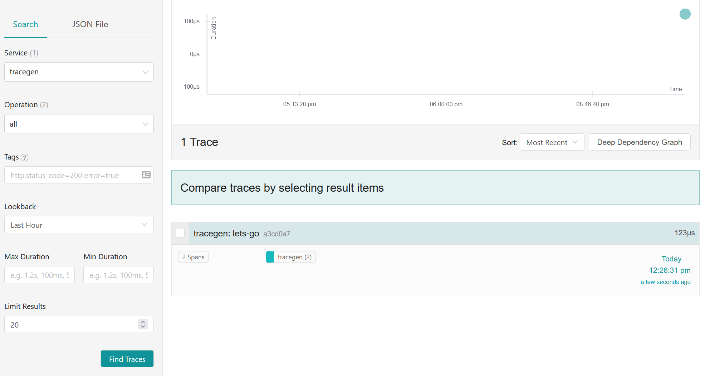

# Background

As I started to investigate OpenTelemetry (OTel) deployment and hosting patterns, one of the questions I hoped to answer was: **what is the recommended security posture for OpenTelemetry collectors (both Gateway and Agent), especially when deployed into a public network?**

Although the [OpenTelemetry Security Guidance](https://github.com/open-telemetry/opentelemetry-collector/blob/main/docs/security.md) states that "Receivers/Exporters...SHOULD use encryption and authentication", I couldn't find a lot of functional examples that implemented this guidance.

Agent collectors tolerate insecure communication since they typically run on the same host as the application (as a binary, sidecar or daemonset) and communicate over the local network. To secure a Gateway collector deployed on a public network, Juraci Paixão Kröhling's [Securing your OpenTelemetry](https://medium.com/opentelemetry/securing-your-opentelemetry-collectIor-1a4f9fa5bd6f) guide from late 2020 provided the most detailed and nuanced instructions I was able to find.

However, some of the authentication patterns and extensions, e.g.,`per_rpc_auth` and `oidc`, have changed since the original guide. If you follow the instructions to the letter, you'll likely end up wih a not-quite functional authentication flow:

```txt
gateway_1  | Error: cannot load configuration: error reading receivers configuration for otlp: 1 error(s) decoding:
gateway_1  | * 'protocols.grpc.auth' has invalid keys: oidc
agent_1    | Error: cannot load configuration: error reading exporters configuration for otlp/auth: 1 error(s) decoding:
agent_1    | * '' has invalid keys: per_rpc_auth
```


It's a frustrating feeling as a developer (and also where I started with this demo). At some point I'm sure the security guidance in this updated guide will be superseded&mdash;if it does, I hope some enterprising reader considers contributing a v3 guide back to the OpenTelemetry community 😍.

## Updated Guide

This updated guide to _Securing Your Open Telemetry Collector..._ relies heavily on the prior art from the original article and will frequently reference it directly when the original advice remains unchanged.

By the end of this demo, traces originating from your application should flow (securely) from the Agent collector to the Gateway collector. The Gateway collector will export the traces to a [Jaeger](https://www.jaegertracing.io/docs/1.26/) backend, which is an open source distributed tracing system that provides both a backend data store and visualization UI.

To restate the data flow again:

1. An application exports data to the OpenTelemetry Agent collector.
1. An OpenTelemetry Agent collector receive trace data and exports it to the Gateway Collector using a bearer token
1. An OpenTelemetry Gateway collector validates the token, receives trace data from an Agent, and exports it to the Jaeger service
1. A Jaeger service receives the data and stores it in an in-memory data store
1. The Jaeger visualization UI displays trace data to end users

In this example implementation, the Agent and Gateway collectors are deployed into the same local network with a security boundary (token authentication) enforced between them.

More typically, the Agent and Gateway collectors will be deployed separately and not communicate over a local network. Fortunately for us, authentication behaviors between the Agent and Gateway collectors should not change regardless of its network configuration, so you can redeploy your gateway separately and validate the same behavior. 

One other note about this guide before we get started: _most of the complexity is setting up your authentication service locally and securing local network traffic using self-signed certificates (OpenTelemetry bars using authentication pattern over insecure networks)._

Once you complete these setup steps, however, we should be able to securely transmit traces from our Agent to Gateway collectors.

## Dependencies

This guide requires several tools to correctly configure your working environment and assumes some fluency with each. These tools include:

1. [Docker](https://docs.docker.com/get-docker/) to manage containers used throughout this demo
1. [CloudFoundation cfssl](https://github.com/cloudflare/cfssl/blob/master/README.md) to generate self-signed certs for your OpenTelemetry collectors (you can't use authentication extensions over insecure networks)

    ```bash
    # go 1.17+
    go install github.com/cloudflare/cfssl/cmd/...@latest

    #go prior to 1.17
    go get github.com/cloudflare/cfssl/cmd/...
    ```

1. [TraceGen](https://github.com/open-telemetry/opentelemetry-collector-contrib/tree/main/tracegen) to mimic application traffic and generate sample traces

    ```bash
    # go 1.17+
    go install github.com/open-telemetry/opentelemetry-collector-contrib/tracegen@v0.34.0

    # go prior to 1.17
    go get github.com/open-telemetry/opentelemetry-collector-contrib/tracegen    
    ```

## Secure local network communication

If you try to use the `insecure` OTLP exporter property for the Agent collector in this demo, you will likely see OpenTelemetry Agent logs that state:

```bash
Error: cannot setup pipelines: cannot start builtExporters: grpc: the credentials require transport level security (use grpc.WithTransportCredentials() to set)
```

We'll use self-signed certs to secure our service-to-service communication over our local network. Importantly, the host name for these self-signed certs is `gateway` (the service name for our OpenTelemetry Gateway collector in our [Docker compose](./docker-compose.yaml) file). Using a different name, e.g., `localhost` will generate the following error once your collectors try to establish a secure connection: "authentication handshake failed: x509: certificate is valid for localhost, not gateway"

To generate the appropriate certificate files, execute the following commands from a terminal:

```bash
pushd certs
./generate-certs.sh
popd`
```

## Authentication Service

Now that we've generated the certificate artifacts for secure network communication, let's launch the authentication service, the _sine qua non_ of this guide. Like the original guide, we'll use the open source identity and access management tool [Keycloak](https://www.keycloak.org/) for this demo. _Note: you're welcome to bring your own authentication service if you have one lolling around; if you do, you may need to make minor adjustments to subsequent steps._

We'll launch our local authentication service into a [user-defined bridge network](https://docs.docker.com/network/bridge/). This allows cross-container communication between our authentication service and some of the other services we'll create in this demo.

```bash
network_name="pullman"
docker network create $network_name
```

Now that we've created a network, start your local authentication service to use this network.

```bash
auth_service_name="keycloak"
docker run -p 8080:8080 -e KEYCLOAK_USER=admin -e KEYCLOAK_PASSWORD=admin --network $network_name --name $auth_service_name jboss/keycloak
```

## Configure realm, and clients

The instructions from the original guide on [configuring your authentication server](https://medium.com/opentelemetry/securing-your-opentelemetry-collector-1a4f9fa5bd6f#cb86) are still valid, so please complete them before heading back here. One detail from the original guide I highly endorse noting: "by default, Keycloak tokens are valid for only 5 minutes." This is fairly short, especially if you need to diagnose misconfiguration issues. You can extend the token lifespan to up to 10 hours under the _Advanced Settings_ for the `agent` client.

Once completed, you should have a `realm` and two clients named `collector` and `agent` respectively. Make sure to note the secret associated with the latter, as you'll need it to generate the bearer token provided by your Agent collector.

## Generate Authentication Environment Variables

The Docker containers running our OpenTelemetry collectors retrieves required authentication values from environment variables (provided via a file named `service.env` with key-value pairs tha mirror the structure below):

_service.env_
```ini
GATEWAY_BEARER_TOKEN="value"
ISSUER_URL="value"
```

If you're using your own authentication service, you can create manually created file with the required key-value pairs and proceed to the next section (_Run Services_). If you use the local authentication service we created earlier, these next steps should simplify generating a well-formed environment variable file with valid key-value pairs. *Note that we run this Docker image in the same user-defined bridge network. This ensures that the token we generate is for the same domain that our service runs on.*

```bash
# Value from previous step
client_secret=?
token_endpoint="http://${auth_service_name}:8080/auth/realms/opentelemetry/protocol/openid-connect/token"
issuer_url="http://${auth_service_name}:8080/auth/realms/opentelemetry"
docker build . -t otel-auth:latest

docker run `
    -v $PWD/:/tmp/otel `
    -e token_endpoint=$token_endpoint `
    -e issuer_url=$issuer_url `
    -e client_id=agent `
    -e client_secret=$client_secret `
    -w /tmp/otel `
    --net $network_name `
    otel-auth:latest
```

## Run services

At this point, we've completed all the necessary configuration to secure out local network, run our authentication service, and generate a bearer token to provide on requests from your Agent collector.

We'll use a [Docker compose file](./docker-compose.yaml) to orchestrate bringing up the remaining services for this authentication demo:

1. Jaeger (backend for trace data and visualization layer)
1. OpenTelemetry Gateway collector (validates the bearer token)
1. OpenTelemetry Agent collector (provides the bearer token)

```bash
# note: the compose file will correctly orchestrate the service dependencies while bringing them online
docker-compose up
```

There's a few log lines that will help us understand if the services are operating as expected (condensed for clarity):

```txt
gateway_1  | Everything is ready. Begin running and processing data.
gateway_1  | State of the connection with the Jaeger Collector backend {"kind": "exporter", "name": "jaeger", "state": "READY"}
agent_1    | Everything is ready. Begin running and processing data.
```

If you see these lines, you're in the clear to start receiving traces from your application 🙌. If not (and it happens to all of us), you've got a bit of debugging and troubleshooting to do before you're ready to roll.

## Generate Trace Data

The moment we've all been waiting for: sending traffic from an application to your Agent collector, then Gateway collector, and then storage backend. We'll simulate some application traffic using `tracegen`. 

To get started, we'll generate a single trace:

```bash
tracegen -otlp-insecure -traces 1
```

You should be able to navigate to the [Jaeger Visualization UI](http://localhost:16686), and see the trace data for your service.


Once you are more familiar with the flow, you can generate larger volumes of trace data by using the `-duration` CLI flag. 

```bash
tracegen -otlp-insecure -duration 5s
```

For additional fingers-to-keyboard experience with instrumenting an application, follow the [Python code sample](https://opentelemetry-python.readthedocs.io/en/latest/exporter/otlp/otlp.html) for an OTLP exporter.

## Conclusion

At this point, you likely have a working implementation. If you don't, I'd love to hear where your stuck. since there's a decent chance you're not the only person to get hung up on potentially unclear or ambiguous instructions. If you drop a note in the comments, I can try to make the guide more explicit and obvious for the next reader.

## Next steps

My experience building software is that it's much easier to understand important systems behaviors when they're broken rather than functioning as expected: _what assumptions about the behavior of our system do not hold true under certain conditions_?

I've provided a few suggestions for [experiments](./experiments.md) you might try to break our sample implementation and observe the system's failure modes 😍.

## Resources

1. [Securing Your OpenTelemetry Collector](https://medium.com/opentelemetry/securing-your-opentelemetry-collector-1a4f9fa5bd6f)
1. [OpenTelemetry Security Guidance](https://github.com/open-telemetry/opentelemetry-collector/blob/main/docs/security.md)
1. [Jaeger](https://www.jaegertracing.io/docs/1.26/)
1. [TraceGen](https://github.com/open-telemetry/opentelemetry-collector-contrib/tree/main/tracegen)
1. [CloudFlare cfssl](https://github.com/cloudflare/cfssl)